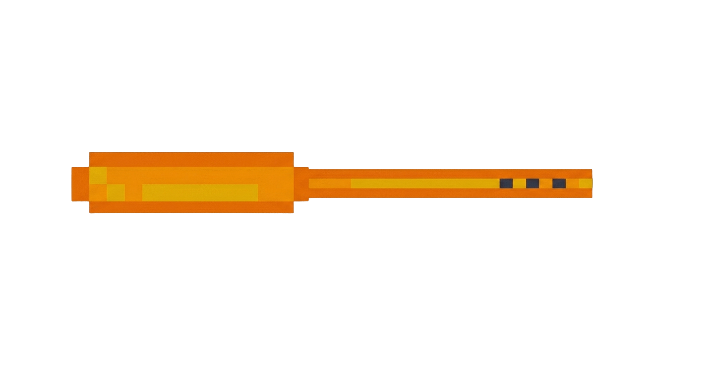
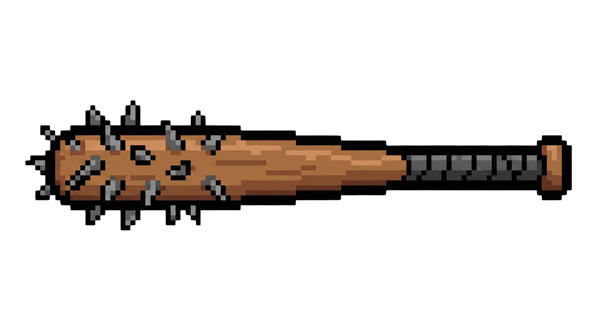
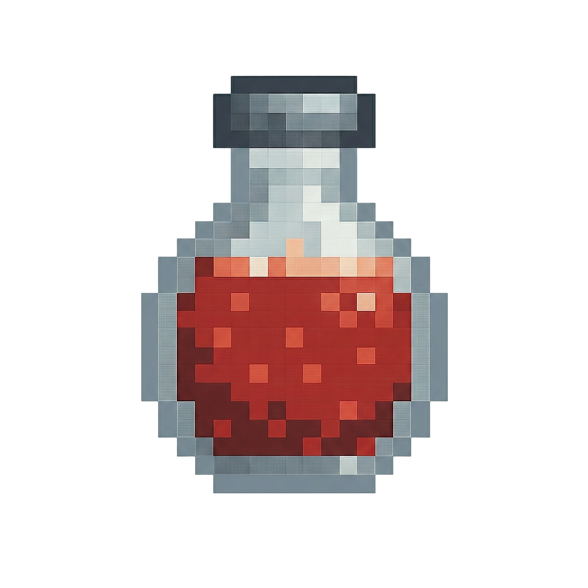

# TTRPG Game - The Last Lift
 _(formerly **dnd-dungeon-master**)_

A turn-based dungeon RPG built with **C++**, **raylib**, and **raygui**.  
Players explore the dungeon using on-screen controls, battle enemies with melee and ranged attacks, collect keys and weapon upgrades, and attempt to escape before being defeated.

---
## How to Build and Run (Very Important)

To run the program, you must first have **raylib** installed on your system. Please refer to the [raylib installation guide](https://raylib.com/) for your specific device if you are having issues with following these steps. **Also please feel free to reach out to us if you have any questions or run into any issues!**

On Windows, go to raylib's [Windows installation instructions](https://raylib.com/) and download the windows installer. Follow the steps in the installer to set up raylib on your system

On Linux, you can install raylib using your package manager. For example, on Ubuntu, you can run:

```
sudo apt-get install libraylib-dev
```

On MacOS, you can install raylib using Homebrew. Run the following command in your terminal:

```
brew install raylib
```

After installing raylib, follow the instructions below to build and run.
### 0. Download the Project ###
- Clone the repository or download the ZIP file from GitHub and extract it to your desired location

 or 

- Download the ZIP file from Canvas and extract it to your desired location

### 1. Compile ###
- To run this portion of the project, you will also need `make` installed on your system.

    - On Windows, you can install `mingw32-make` using MSYS2 URCT with the command 
    ```
    pacman -S mingw-w64-ucrt-x86_64-gcc mingw-w64-ucrt-x86_64-make
    ```


    - On Linux, `make` is usually pre-installed. If not, you can install it using your package manager. For example, on Ubuntu, you can run:
    ```
    sudo apt-get install build-essential
    ```
    - On MacOS, you can install `make` using Homebrew. Run the following command in your terminal:
    ```
    brew install make
    ```

- Once you have `make`  or `mingw32-make` installed, navigate to the root directory of the project in your terminal and run the following command:
    
    On Windows:
    ```
    mingw32-make
    ```

    On Linux or MacOS:
    ```
    make
    ```

- This will compile the source files and create an executable named `TheLastLift` (or `TheLastLift.exe` on Windows) in the `src` directory.

### 2. Run the game ###

- You can run the game either by clicking the executable directly or by using the terminal.

    On Windows:
    ```
    src\TheLastLift.exe
    ```

    On Linux or MacOS:
    ```
    ./src/TheLastLift
    ```
- Now, enjoy the game.

## Screen Flow / GUI
Main Files: `screenManager.h / screenManager.cpp` and `main.cpp`
- **Main Menu**
  - Background + title textures
    - `Start Game` = goes to character select  
    - `Exit Game` = closes the game  
    - `Load Saved Game` = proceeds game from where you last left off

- **Character Select**
  - 4 character cards: Student, Rat, Professor, Attila  
  - Cards are centered in a row and smoothly animate:
    - No selection = all in a row
    - One selected = that card centers, others “dock” on the right  
  - Hovering a card shows a stats/info box
    - Student stats read from `dat/Character_Starting_Stats.csv`
  - Only **Student** is selectable right now (for this milestone)
  - `Play Game` button:
    - Disabled when nothing is selected
    - When Student is selected:
      - Creates `Student` and `Zombie_Standard` (only for this milestone)
      - Switches to gameplay/combat

- **Gameplay (Combat UI)**
  - Handled by `GameManager` in `COMBAT` state
  - Draws:
    - Background environment
    - Player and enemy sprites
    - Left/right side panels for player/enemy
    - HP bars that scale with `currentHP / maxHealth`
    - Bottom panel with buttons: `Attack`, `Defend`, `Use Item`
    - Log box to show the **last** action’s message (will be a scrolling log later)
  - See **How to Play** below for an explanation on how to play the game

---

## How to Play

### Movement
Use the **red arrow buttons on the screen** to move your character around the map. Explore carefully as enemies, keys, and upgrades are scattered throughout the dungeon.

### Combat
When you encounter an enemy, you will enter combat. During your turn, you can choose from the following actions:

- **Attack**
  - Choose between **Melee** or **Ranged** attacks.
  - Whether your attack hits is based on **random chance**.
  - The amount of damage dealt is also **random**.

- **Defend**
  - Decreases the chance an enemy’s next attack will land.

- **Use Potion**
  - Use a **healing potion** to restore 15 of your health if one is available.

### Objective
Your main goal is to:
1. **Find the keys hidden around the map**
2. **Reach the exit**
3. **Escape the building before you are defeated**

Along the way, you can also:
- Pick up **weapon upgrades** that improve your combat effectiveness.

You can save your progress at any time outside of combat by pressing the pause button in the top right and selecting **save & exit**. Your progress will be saved and you will return to the title screen.

---

### Key Item (on its side)
<p align="center">
  
</p>

---

### Weapon Upgrade
<p align="center">
  
</p>

---

### Health Potion
<p align="center">
  
</p>

---

## Code Layout

- `screenManager.h / screenManager.cpp`
  - `ScreenManager`
    - Controls high-level screen flow:
      - `MAIN_MENU`
      - `CHARACTER_SELECT`
      - `GAMEPLAY`
      - `SAVE_QUIT`
    - Handles screen transitions and lifecycle:
      - `enterScreen()`
      - `exitScreen()`
    - Manages loading and unloading of textures, UI rectangles, and screen-specific assets

  - `GameManager`
    - Controls in-game state logic:
      - `EXPLORATION`
      - `COMBAT`
      - `DIALOGUE`
      - `PAUSE_MENU`
    - Handles:
      - Player movement and map interaction
      - Enemy encounters and combat triggering
      - Combat UI setup and rendering
      - Game over and victory transitions

  - GUI style and layout helpers:
    - Menu styling and layout configuration
    - Character select UI styling
    - Shared GUI visual settings

  - Character select:
    - Animation handling
    - Character portrait positioning
    - Input handling and transitions

- `characters.h / characters.cpp`
  - Base `Character` class
  - Derived character types:
    - `Student`
    - Enemy and non-player character classes
  - Core stat structures:
    - `Attributes`
    - `DefenseStats`
    - `CombatStats`
    - `VitalStats`
    - `StatusEffects`

  - Character creation system:
    - Character factory for spawning players and enemies by ID
    - Shared stat initialization used by both gameplay and combat systems

  - Inventory and items:
    - `Item` definitions
    - Consumable healing items
    - Weapon and upgrade support

  - Character behavior:
    - Melee and ranged damage dealing
    - Healing
    - Death detection

- `combat.h / combat.cpp`
  - Core turn-based combat logic
  - Player actions:
    - `resolve_melee()`
    - `resolve_ranged()`
    - `resolve_inventory()`
  - Damage, hit/miss, and defend resolution
  - Combat log system:
    - `AddNewLogEntry()`
  - Combat state tracking:
    - Player turn / enemy turn
    - Defending states
    - Victory / Game Over detection

- `rng.cpp / rng.h`
  - RNG utilities for damage rolls, AI decisions, etc.

- `progressLog.h / progressLog.cpp`
  - Game progression and event tracking
  - Logs key player actions and milestones
  - Used to record:
    - Combat outcomes
    - Item pickups
    - Player progression
  - Provides a centralized history system for gameplay events

- `trialSebastian.cpp`
  - Console combat engine and temporary `main()` for combat testing

- `assets/`
  - `fonts/...` – JetBrains Mono Nerd Font used across all UI displays
  - `images/...`
    - `images/UI/...` – menu visuals (start menu, character select)
    - `images/characters/...` – player and enemy sprites (character select + gameplay)
    - `images/environments/...` – exploration and combat backgrounds
    - `images/items/...` – consumable items, weapon upgrades, and story items
  - `sfx/...` – all sound effects and background music

- `dat/`
  - `usrData/...`
    - `savegame.json` – all saved player progress and game state
  - `Character_Starting_Stats.csv` – base starting stats for all characters

---

## Credits

- **Programming:**  
  Edwin Baiden, Sebastian Cardona, and Andrew Kurtz

- **Art & Image Assets:**  
  Many of the visual assets were created using image editing and generation tools, including **GIMP**, **OpenAI’s image generation tools**, and **Pixelorama**.

- **Music:**  
  Special thanks to **Aaron Kurtz** for composing and producing the music for the game.

---

## Status / Notes

- Only **Student** is playable and selectable.
- Rat, Professor, and Attila exist visually in the character select screen but have no real implementation yet

---

## What's Next

- Finish the story for the **Student** character.
- Implement gameplay and story paths for all characters.
- Expand the combat system, including more consumables and weapon upgrades for the player.
- Randomize zombie spawns and item placement around the map.
- Implement status effects (e.g., poison) for both player and enemy attacks.
- Improve the **minimap** for better navigation and clarity.
- Balance the combat system to fine-tune difficulty and pacing.

---


